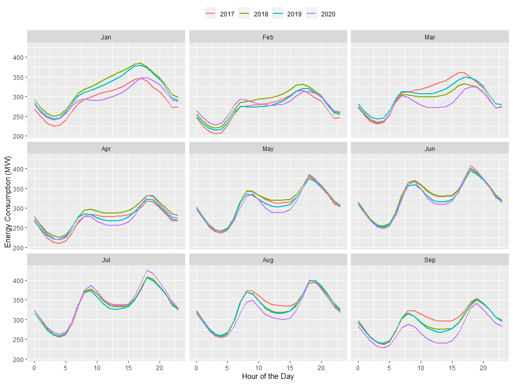
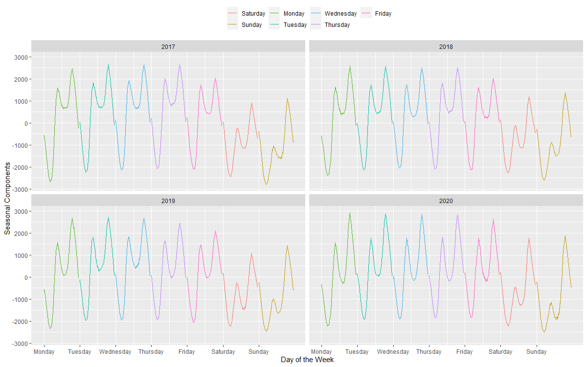
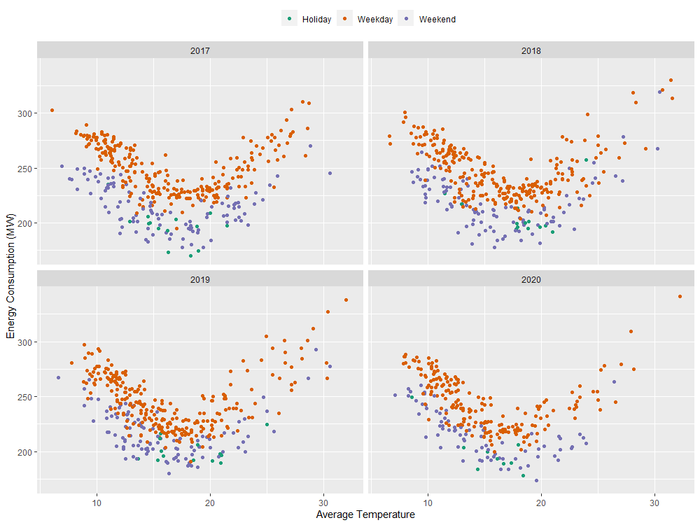
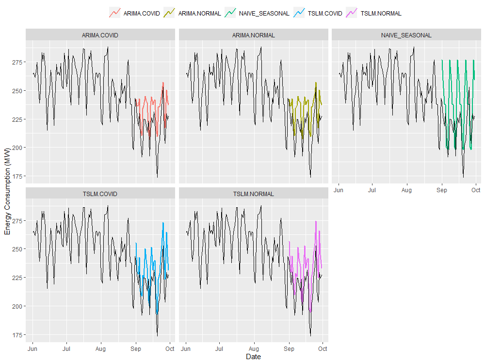

```{r setup, include=FALSE}
knitr::opts_chunk$set(echo = TRUE)
```

```{r, message = FALSE, echo=FALSE, include=FALSE}
library(vroom)
library(stringr)
library(tsibble)
library(tidyverse)
library(feasts)
library(fable)
library(dplyr)
library(lubridate)
```


## Introduction {-}

The year 2020 has been a challenging year for the humankind. As a result of the COVID19 restriction measures (working from home, social distancing), the everyday energy consumption patterns have been disrupted. In this study, I made an effort to visualise this impact using the *Australian Energy Market Operator, half-hourly energy demand dataset (for the state of Victoria)*, which is publicly available from [[1]](https://www.aemo.com.au/energy-systems/electricity/national-electricity-market-nem/data-nem/aggregated-data).

## Aggregated Energy Consmption Analysis {-}

```{r hourly, echo=FALSE, fig.cap="The aggregated hourly energy consumption in the state of Victoria", out.width = "100%", fig.align="center"}

```

The Figure \@ref(fig:hourly) demostrates the hourly aggregated energy consumption for each month from year 2017. Following are the main observations:

* The presence of daily seasonality (one peak in the morning, and other peak in the evening) across all the years. 
* In year 2020, from the month of April (with COVID restrictions), the hourly energy consumption gets started to increase, overlapping with the consumption levels of the previous years.
* In year 2020, for the month of **July** (more tougher restrictions imposed in Victoria), the total hourly energy consumption (including the daily peaks) is much higher compared to its previous years.
* As a result of the COVID19 restrictions, more people were enforced to stay at home, leading to higher daily energy consumption levels.


## Seasonal Consumption Analysis {-}


```{r hourlyseasonal, echo=FALSE, fig.cap="The daily seasonal energy consumption distribution from April to September", out.width = "100%", fig.align="center"}
knitr::include_graphics("images/daily_seasonal.png")
```

The Figure \@ref(fig:hourlyseasonal) illustrates the daily seasonal energy consumption components over the years (from April to September, focusing on the COVID19 restriction period in Victoria). The *STL decomposition* method  [[2]](https://cran.r-project.org/web/packages/fable/index.html) is used to extract the daily seasonality. Following are the main observations:

* It is evident that the morning energy consumption peak (around 9 A.M - 10 A.M) is much higher in the year 2020, compared to previous years.
* The average energy consumption during the off-peak (11 A.M to 4 P.M) is comparatively higher in the year 2020 (more people staying at home).


```{r weeklyseasonal, echo=FALSE, fig.cap="The weekly seasonal energy consumption distribution from April to September", out.width = "100%", fig.align="center"}

```

The Figure \@ref(fig:weeklyseasonal) demostrates the weekly seasonal energy consumption components over the years. Following are the main observations:

* The average energy consumption in the weekdays is higher compared to weekend (The presence of weekly seasonality).
* In year 2020, we observe higher energy consumption peak levels on Fridays, Saturdays, and Sundays, compared to other years. This indicates lesser outdoor activities in the weekends during the pandamic.

## Energy Consumption Variations in July {-}

```{r july, echo=FALSE, fig.cap="The variations of energy consumption in the month of July", out.width = "80%", fig.align="center"}
knitr::include_graphics("images/july_consume.png")
```

```{r temp, echo=FALSE, fig.cap="The daily aggregated energy consumption against the daily average temperature, from Jan 2017 to Sep 2020", out.width = "80%", fig.align="center"}

```

As identified from Figure \@ref(fig:hourly),  compared to previous years, the month of July in year 2020 shows higher levels of energy consumptions. The Figure \@ref(fig:july) shows the energy consumption in July across past few years. Following are the main observations:

* The energy consumption differences between the weekdays and weekend are minimal for the year of 2020.
* Due to COVID19 restrictions, even in the weekends, people are enforced to stay at home, leading to consumption patterns similar to weekdays.


## Daily Energy vs Daily Temperature {-}

The Figure \@ref(fig:temp) shows the relationship between the daily aggregated energy consumption and the average temperature, faceted by the type of the day: a Weekday, a Weekend, or a Holiday. The daily temperature data is collected from [[3]](http://www.bom.gov.au/climate/data/), whereas [[4]](https://data.gov.au/dataset/ds-dga-b1bc6077-dadd-4f61-9f8c-002ab2cdff10/details) is used as the official source to combine the victorian holidays.

* There exist a non-linear relationship between the energy consumption and the average temperature.
* The temperature around 20$^\circ$C can be considered as the optimal temperature that minimises the overall energy consumption.


## Energy Forecasting {-}

Based on the previous findings, I fit a host of forecasting models to predict future energy consumption using [[2]](https://cran.r-project.org/web/packages/fable/index.html). The proposed models are, the ARIMA model without the COVID19 dummy variable (*ARIMA.NORMAL*), the ARIMA model with the COVID19 dummy variable (*ARIMA.COVID*), the Time series Regression model without the COVID19 dummy variable (*TSLM.NORMAL*), the Time series Regression model with the COVID19 dummy variable (*TSLM.COVID*), and the Naive Seasonal model without any exogenous variable (*NAIVE_SEASONAL*). The **COVID restriction dummy variable** is introduced for the period from Apr 2020 to Sep 2020 to represent the COVID19 restrictions.

Training period: **2017 Jan - 2020 Aug**, Test period: **2020 Sept** , and *Mean Absolute Scaled Error (MASE)*, *Root Mean Square Error (RMSE)* are used as the evaluation measures. Please refer to [[5]](https://github.com/kasungayan/Meldatathon2020) for the detailed explaination of the experimental setup (external variables, model selection, residual analysis)

Table \@ref(tab:results) summarises the results of the proposed forecasting benhmarks. The **TSLM.COVID** performs the best, recording the lowest *RMSE* and *MASE*. Also, among ARIMA varaints, the **ARIMA.COVID** variant outperforms the *ARIMA.NORMAL*. This indicates the importance of accounting for the COVID19 restriction factor when forecasting energy consumption under current circumstances. The Figure \@ref(fig:forecast) illustrates the predictions for each forecast model.


```{r results, echo=FALSE}
Method <- c('ARIMA.COVID', 'ARIMA.NORMAL', 'TSLM.COVID', 'TSLM.NORMAL','NAIVE_SEASONAL')
RMSE <- c(19.60, 19.60, 18.40, 19.60,30.70)
MASE <- c(0.970, 0.971, 0.906, 0.978, 1.41)

results <- data.frame(Method, RMSE, MASE)

knitr::kable(results, caption = "Forecasting Error Summary")
```

```{r forecast, echo=FALSE, fig.cap="The model forecasts vs actual observations for September 2020", out.width = "70%", fig.align="center"}

```


## References {-}

[1] [AEMO Energy Consumption Dataset](https://www.aemo.com.au/energy-systems/electricity/national-electricity-market-nem/data-nem/aggregated-data)

[2] [fable Package](https://cran.r-project.org/web/packages/fable/index.html)

[3] [BOM Weather Data](http://www.bom.gov.au/climate/data/)

[4] [Australian Holidays](https://data.gov.au/dataset/ds-dga-b1bc6077-dadd-4f61-9f8c-002ab2cdff10/details)

[5] [Detailed Analysis](https://github.com/kasungayan/Meldatathon2020)

[6] [feasts Package](https://cran.r-project.org/web/packages/feasts/index.html)


