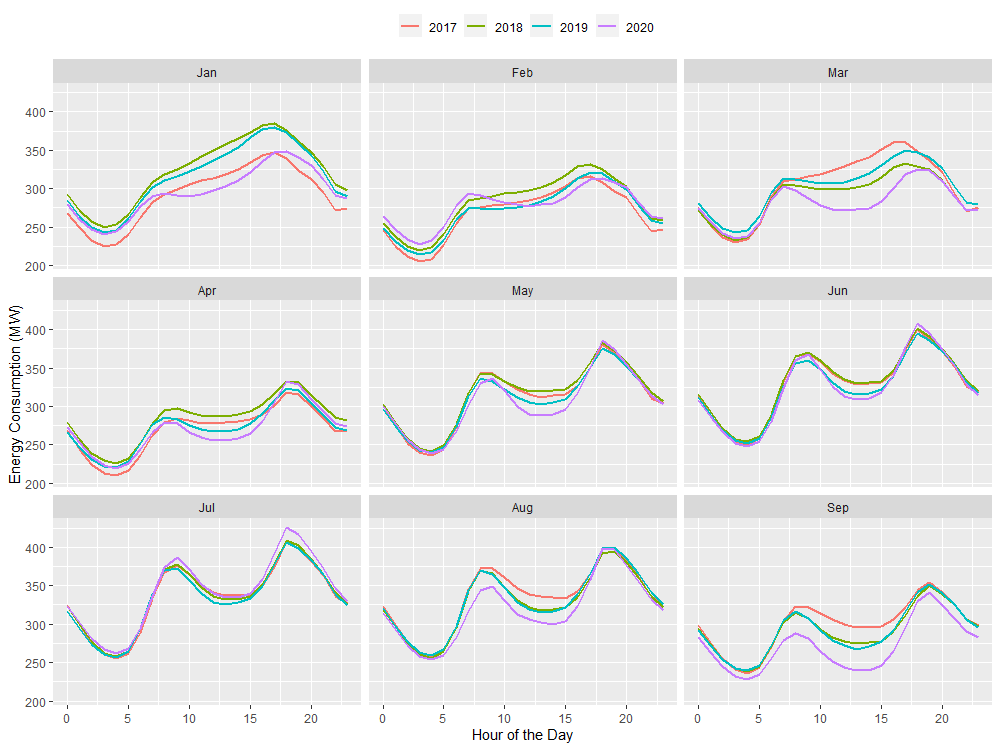
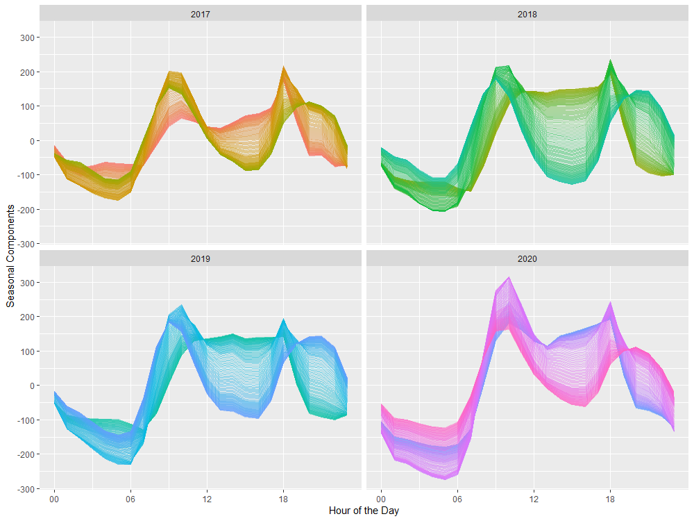
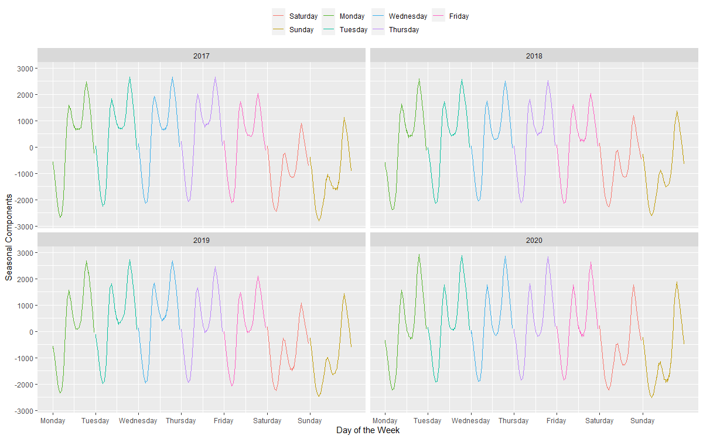
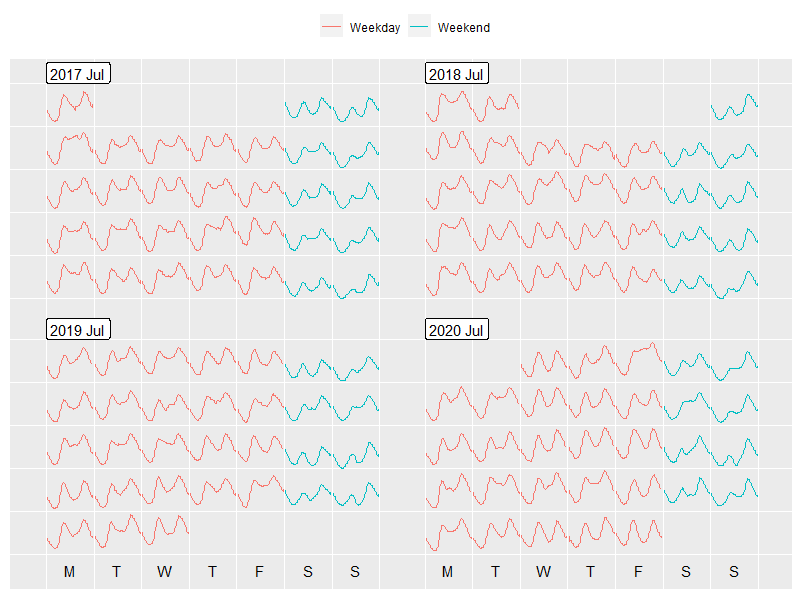
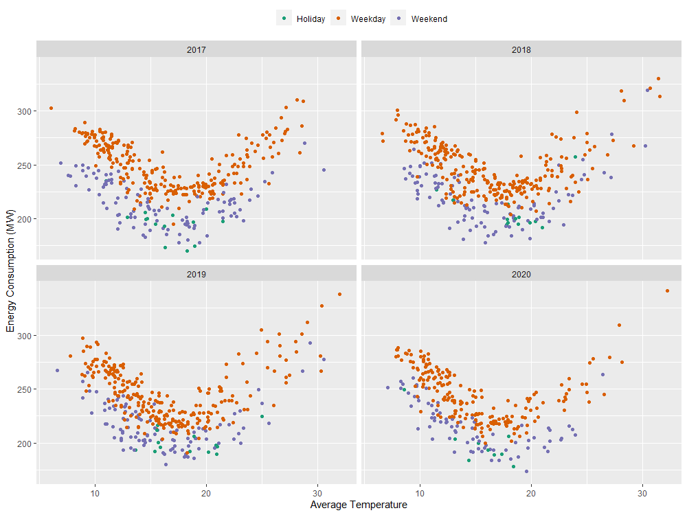
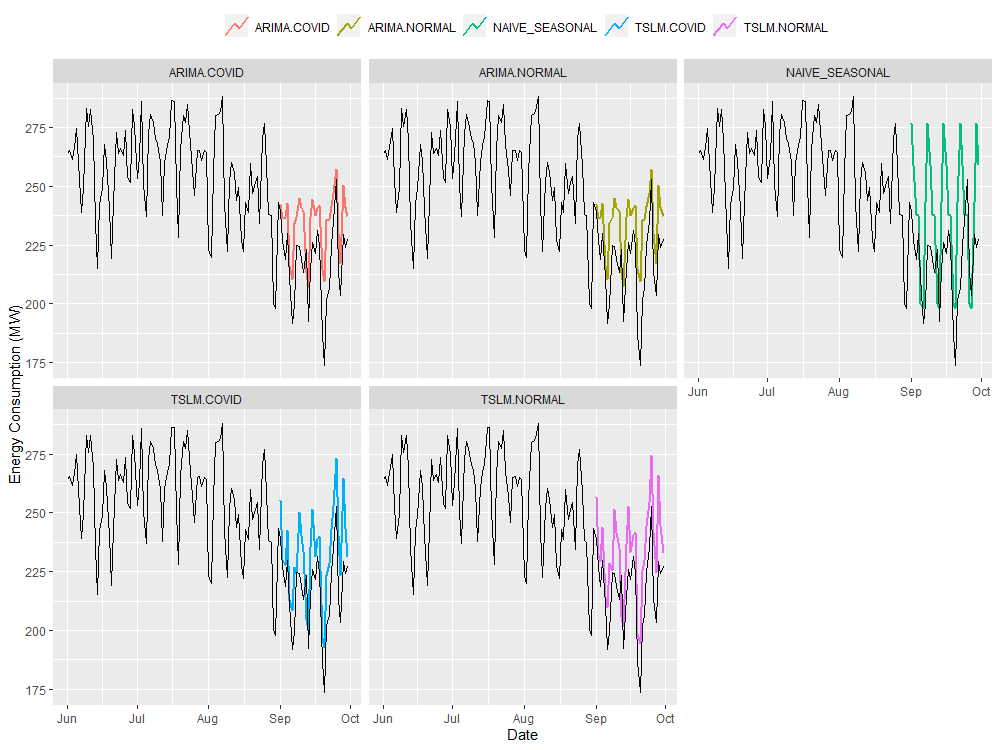

## Melbourne Datathon 2020: Energy Demand Forecasting during a Pandemic.

This repository includes the reproducible source code for the Melbourne Datathon 2020 submission titiled as "Melbourne Datathon 2020: Energy Demand Forecasting during a Pandemic".

## Directory Structure
```
|-MelbourneDatathon2020-Solution.Rmd - PDF file for the solution
|-MelbourneDatathon2020-Solution.Rmd - Rmarkdown file for the solution
|-MelbourneDatathon2020-AdditionalAnalysis.pdf - additional analysis PDF format
|-MelHack-AdditionalAnalysis.Rmd - source code for the analysis (including the additional analysis)
|-MelHack-Additional.html - additional analysis html format
|-images - Images folder
|-energy_data - Energy data folder
|-Temp - Temp data folder
|-Holidays - holiday data folder
```

Below are the generated figures used in this analysis. 







